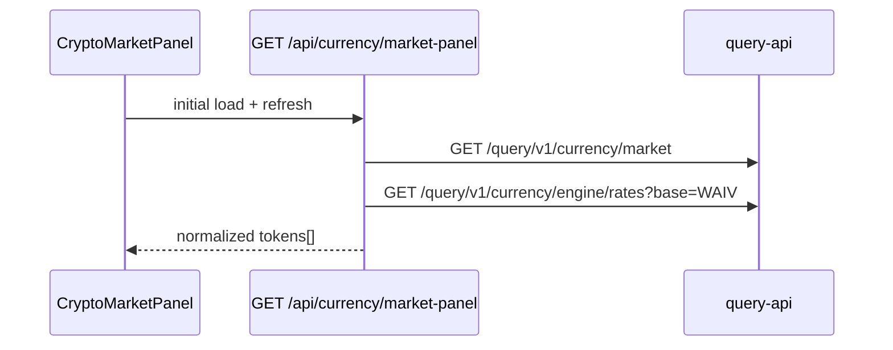

# Currency market widget

**Back:** [transfers](transfers.md)

## Purpose

Legacy parity for `CryptoTrendingCharts` on the wallet page: show **WAIV**, **HIVE**, and **HBD** USD prices, optional secondary quotes, and an expandable **weekly sparkline** per token.

Visible to **all viewers** on `/@:name/transfers` (not owner-only).

## Right rail layout (transfers tab, desktop `lg+`)

The transfers right sidebar stacks three blocks in legacy order:

1. **`WalletActionsSidebarTop`** — owner only: transfer, power up/down, manage delegations
2. **`CryptoMarketPanel`** — all viewers: market card
3. **`WalletActionsSidebarBottom`** — owner only on **WAIV** or **ENGINE** tab: swap, deposit, withdraw (hidden on **HIVE** tab)

Implementation: `apps/web/src/modules/user-profile/presentation/components/right-sidebar.tsx`.

- **Desktop-only:** right rail is hidden below `lg` and in Instagram shell (`shell-hide-instagram`).
- **Client-only fetch:** panel loads on mount via BFF (`GET /api/currency/market-panel`); skeleton until first response. No SSR prefetch today (profile shell is client-rendered).

## UI

| Piece | Module path |
|-------|-------------|
| Panel shell + refresh | `apps/web/src/modules/currency/presentation/components/crypto-market-panel.tsx` |
| Token row | `crypto-market-row.tsx` |
| Price labels | `crypto-price-display.tsx` |
| SVG chart | `line-chart-svg.tsx` (no chart library) |

- Header: `market` i18n key + manual refresh (↻).
- Auto-refresh every **60s** when the document tab is visible (legacy parity).
- Expand/collapse per token reveals sparkline with weekday labels (Wed–Tue chronological order).
- Hover on chart shows date + USD tooltip (portal, `z-index: 50`).
- **Decimals:** WAIV **3** dp; HIVE and HBD **2** dp for USD.
- Initial load failure: blocking error message. Refresh failure with stale data: non-blocking status banner; stale prices remain visible.

## Data flow

| Token | query-api source | Sparkline |
|-------|------------------|-----------|
| HIVE | `currency/market` | `weekly[].hive.usd` (chronological) |
| HBD | `currency/market` | `weekly[].hive_dollar.usd` |
| WAIV | `currency/engine/rates` | `weekly[].rates.USD` |

Secondary quotes:

- HIVE → BTC (`market.current.hive.btc`)
- WAIV → HIVE (`engine/rates.current.rates.HIVE`)
- HBD → USD only (no % change in legacy)

If `engine/rates` returns `error: no_data` or `current` is null, WAIV row shows `—` and empty sparkline.

WAIV spot is read from Postgres `hive_engine_rates` (scheduler refresh ~5 min), not live Hive Engine RPC on each panel load.

## BFF

`GET /api/currency/market-panel` — aggregates both query-api calls and returns normalized `CurrencyMarketPanelData` (Zod-validated).

Shared builder: `buildCurrencyMarketPanel()` in `apps/web/src/modules/currency/application/build-currency-market-panel.ts` (used by the BFF route handler).

## Out of scope

- Full WAIV period chart (`GET /query/v1/currency/engine/chart`) — not in this widget.
- Dedicated `/waiv-page` stats route.
- SSR prefetch for market data (would require an RSC wrapper for the right rail).

## Verification

1. Open `/@:name/transfers` on desktop (right rail visible at `lg+`).
2. Confirm three tokens with USD prices.
3. Expand a row → SVG sparkline renders; hover shows tooltip above sibling rows.
4. Click refresh or wait 60s (tab visible) → prices update without full page reload.
5. View another user's transfers → market visible; owner action groups hidden.
6. `?type=HIVE`: top actions + market; no bottom swap/deposit/withdraw group.
7. `?type=WAIV` or `?type=ENGINE` (owner): top → market → bottom swap group.
