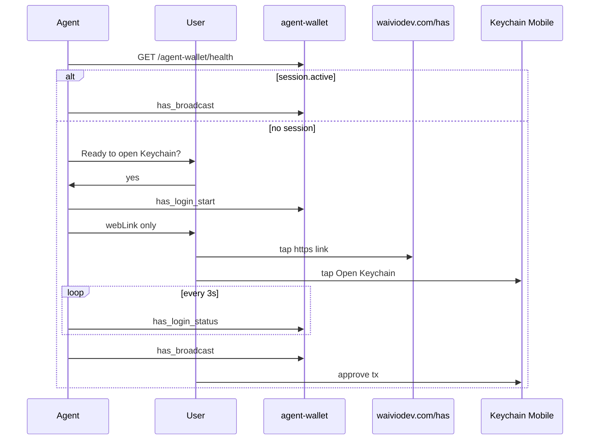

# HAS login from chat (Telegram, Slack)

Playbook for agents that talk to the user in a **messenger on phone** and need a HAS session via local `agent-wallet`.

**Prerequisite:** [hive-has-agent-wallet](hive-has-agent-wallet.md) — daemon running, bearer token known.

## When to use

- User chats with the agent in Telegram, Slack, or similar on the same phone as Keychain Mobile.
- Custody mode is **HAS agent session** ([hive-blockchain-broadcast § Key custody](hive-blockchain-broadcast.md#key-custody-decide-with-the-user-first)).

## When not to use

- User is at a desktop with browser + Keychain extension — use web wallet flow instead.
- User wants to paste posting keys — see [hive-blockchain-broadcast § B](hive-blockchain-broadcast.md#b-hiveiodhive-script--agent-with-session-posting-key).

## Hard rules

| Do | Do not |
|----|--------|
| Send **`webLink`** from `has_login_start` as a **standalone message** (URL only) | Send `qrAscii` in chat — unreadable on the same phone |
| Ask user **"Ready to open Keychain?"** before `has_login_start` | Call `has_login_start` before user confirms |
| Read MCP JSON via **file tool** (`jq` → file → read file) | Pipe long JSON through terminal `cat` (truncates links) |
| Poll `has_login_status` every **3s** | Guess expiry (~5 min is wrong — use `expiresInSec`) |
| After login, use `has_broadcast` (push to phone) | Send another login link for each broadcast |

## Flow



## Step 1 — Check existing session

```bash
curl -s http://127.0.0.1:7500/agent-wallet/health
```

If `session.active === true` for the target account → skip login, go to broadcast.

Also call MCP `has_session` for the same check.

## Step 2 — Readiness gate

Ask exactly (adapt account name):

> Ready to open Hive Keychain for **@flowmaster**? Reply **yes** when your phone is unlocked and Keychain is installed.

**Do not** call `has_login_start` until the user confirms.

## Step 3 — Start login (extract link safely)

```bash
curl -s http://127.0.0.1:7500/agent-wallet/mcp \
  -H "Authorization: Bearer $TOKEN" \
  -H "Content-Type: application/json" \
  -H "Accept: application/json, text/event-stream" \
  -d '{"jsonrpc":"2.0","id":1,"method":"tools/call","params":{"name":"has_login_start","arguments":{"account":"flowmaster"}}}' \
  | jq -r '.result.content[0].text' > /tmp/has-login.json
```

Read `/tmp/has-login.json` with a **file read tool** (not terminal).

Response fields:

| Field | Use in chat |
|-------|-------------|
| `alreadyActive` | `true` → skip link, broadcast now |
| `webLink` | **Send this** — `https://waiviodev.com/has#...` (default origin) |
| `pushSent` | `true` → user gets Keychain push; still send `webLink` as fallback |
| `expiresInSec` | Poll deadline; warn user 15s before expiry |
| `deepLink` | Fallback only — copy-paste into mobile browser address bar |
| `qrAscii` | **Never** send in chat |
| `qrPngPath` | Optional — attach file if messenger supports images from agent host |

## Step 4 — Deliver link to user

Send **one message** containing **only** the URL:

```
https://waiviodev.com/has#eyJhY2NvdW50Ijoi...
```

Rules:

- No markdown code fences around the URL.
- No extra text on the same line (some clients break autolink).
- Tell user: tap link → tap **Open Keychain** on the page.

### Fallback when `webLink` is missing

If `HAS_WEB_LINK_BASE` is empty, send `deepLink` (`has://auth_req/...`) and instruct:

1. Copy the full `has://` string.
2. Open Safari or Chrome on the phone.
3. Paste into the address bar and press Go.

## Step 5 — Poll until active

Every **3 seconds**:

```json
// tools/call has_login_status
{ "requestId": "<from has_login_start>" }
```

- `active` → proceed to broadcast.
- `pending` → continue; if `expiresInSec < 15`, remind user to tap the link.
- `expired` → call `has_login_start` **once more**, send new `webLink` immediately.
- Second `expired` → stop; offer wallet/payload-only mode from [hive-blockchain-broadcast](hive-blockchain-broadcast.md).

## Step 6 — Broadcast (no link needed)

After session is active, `has_broadcast` sends a **push notification** to Keychain. User approves on phone. Poll `has_broadcast_status` every 3s.

## Security

- Never paste bearer token, session file contents, or `auth_key` from links.
- `webLink` / `deepLink` are one-time and expire in under a minute.
- Payload is in URL **fragment** (`#...`) — not sent to the web server.

## Verification

- Daemon health responds without auth.
- `has_login_start` returns `webLink` starting with `https://waiviodev.com/has#`.
- Manual: send link in Telegram → page opens without `/sign-in` redirect → Keychain opens → `has_login_status` → `active`.

## Related

- [hive-has-agent-wallet](hive-has-agent-wallet.md) — daemon setup and MCP tools
- [has-deep-link redirect](../apps/web/spec/has-deep-link-redirect.md) — `/has` page contract
