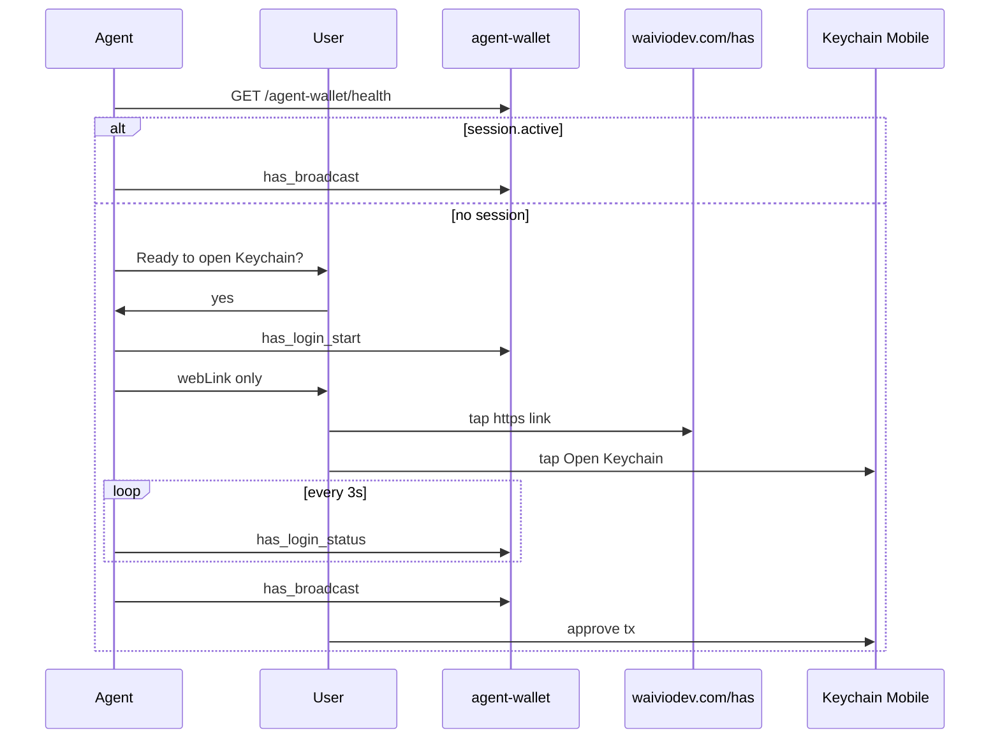

# HAS login from chat (Telegram, Slack)

Playbook for agents that talk to the user in a **messenger on phone** and need a HAS session via local `agent-wallet`.

**Prerequisite:** [hive-has-agent-wallet](hive-has-agent-wallet.md) — daemon running, bearer token known.

## When to use

- User chats with the agent in Telegram, Slack, or similar on the same phone as Keychain Mobile.
- Custody mode is **HAS agent session** ([hive-blockchain-broadcast § Key custody](hive-blockchain-broadcast.md#key-custody-decide-with-the-user-first)).

## When not to use

- User is at a desktop with browser + Keychain extension — use web wallet flow instead.
- User wants to paste posting keys — see [hive-blockchain-broadcast § B](hive-blockchain-broadcast.md#b-hiveiodhive-script--agent-with-session-posting-key).

## Why only `webLink` may go into chat

`deepLink` is `has://auth_req/` plus base64 of a JSON object. Base64 of JSON always starts with `eyJ`, which is exactly the shape of a JWT, so secret redactors in chat clients cut the middle out of it and deliver a broken string. This is measured, not theoretical: a random 230-character URL passes through untouched while a 230-character `eyJ…` URL comes out as `eyJhY2...UifQ==`.

`webLink` uses the compact fragment format instead, which never contains `eyJ` and is about 85 characters. It is the only login string that survives a messenger.

## Hard rules

| Do | Do not |
|----|--------|
| Send **`webLink`** as a **standalone message**, URL only, verbatim | Send `deepLink`, `qrAscii` or anything from `has_login_qr` into chat |
| Send it **within 10 seconds** of `has_login_start` | Ask the user anything between starting login and sending the link |
| Ask **"Ready to open Keychain?"** before `has_login_start` | Call `has_login_start` before the user confirms |
| Copy `webLink` straight out of the tool response | Re-encode, re-assemble or reformat the link with `jq`, `python`, `xxd` |
| Poll `has_login_status` every **3s** | Guess expiry — use `expiresInSec` |
| After login, use `has_broadcast` (push to phone) | Send another login link for each broadcast |

If the string you are about to send contains `…` or `...`, your client truncated it. Do not send it. Say so plainly and switch to the QR fallback in Step 6.

## Flow



## Step 1 — Check existing session

```bash
curl -s http://127.0.0.1:7500/agent-wallet/health
```

If `session.active === true` for the target account, skip login entirely and go to broadcast. MCP `has_session` answers the same question.

Only the **first** login on a machine needs a link. Afterwards the session token is persisted and `has_login_start` re-authenticates with a silent push to Keychain (`pushSent: true`).

## Step 2 — Readiness gate

Ask exactly (adapt account name):

> Ready to open Hive Keychain for **@flowmaster**? Reply **yes** when your phone is unlocked and Keychain is installed.

**Do not** call `has_login_start` until the user confirms. The HAS window is about 60 seconds and cannot be extended.

## Step 3 — Start login

```bash
curl -s http://127.0.0.1:7500/agent-wallet/mcp \
  -H "Authorization: Bearer $TOKEN" \
  -H "Content-Type: application/json" \
  -H "Accept: application/json, text/event-stream" \
  -d '{"jsonrpc":"2.0","id":1,"method":"tools/call","params":{"name":"has_login_start","arguments":{"account":"flowmaster"}}}' \
  | jq -r '.result.content[0].text'
```

The response is deliberately small — no QR, no deep link — so it is safe to read straight off the terminal. Do not write it to a file and re-parse it.

Response fields:

| Field | Use in chat |
|-------|-------------|
| `alreadyActive` | `true` → no link needed, broadcast now |
| `webLink` | **Send this, verbatim** — `https://waiviodev.com/has#1...` |
| `pushSent` | `true` → Keychain also gets a push; still send `webLink` |
| `expiresInSec` | Poll deadline; warn the user 15s before expiry |
| `requestId` | For `has_login_status` and `has_login_qr` |
| `deepLink` | Present **only** when no web link is configured — never goes into chat |

Calling `has_login_start` again for the same account returns the **same** `requestId` and link while the previous one is still alive, so a retry never invalidates a link the user is already looking at.

## Step 4 — Deliver link to user

Send **one message** containing **only** the URL:

```
https://waiviodev.com/has#1AA8rfB6KPUxVmyFtDl9KfDk9nhpELAdPiLblcaLI0EWbZmxvd21hc3Rlcg
```

Rules:

- No markdown code fences around the URL.
- No extra text on the same line — some clients then fail to autolink.
- Tell the user: tap link, then tap **Open Keychain** on the page.

## Step 5 — Poll until active

Every **3 seconds** call `has_login_status` with the `requestId`.

- `active` → proceed to broadcast.
- `pending` → continue; if `expiresInSec < 15`, remind the user to tap the link.
- `expired` → call `has_login_start` once more and send the new `webLink` immediately.
- Second `expired` → stop; offer wallet or payload-only mode from [hive-blockchain-broadcast](hive-blockchain-broadcast.md).

## Step 6 — Fallbacks

Use `has_login_qr` with the same `requestId` only when the web link is unusable:

| Situation | Fallback |
|-----------|----------|
| Your client truncated `webLink` | Send `qrPngPath` as an **image**; user scans it from a second device |
| `HAS_WEB_LINK_BASE` is empty | `deepLink` is returned by `has_login_start`; the user must copy it into a phone browser address bar manually, and chat may still redact it |
| Agent runs in a terminal, not chat | `qrAscii` |

## Step 7 — Broadcast (no link needed)

After the session is active, `has_broadcast` sends a **push notification** to Keychain. The user approves on the phone. Poll `has_broadcast_status` every 3s.

## Security

- Never paste the bearer token, session file contents, or `auth_key` from a link.
- Login links are one-time and expire in under a minute.
- The payload lives in the URL **fragment** (`#...`), so it never reaches the web server.

## Verification

- Daemon health responds without auth.
- `has_login_start` returns `webLink` starting with `https://waiviodev.com/has#1` and containing no `eyJ`.
- Manual: send the link in Telegram, the page opens without a `/sign-in` redirect, Keychain opens, `has_login_status` reaches `active`.

## Related

- [hive-has-agent-wallet](hive-has-agent-wallet.md) — daemon setup and MCP tools
- [has-deep-link redirect](../apps/web/spec/has-deep-link-redirect.md) — `/has` page contract
