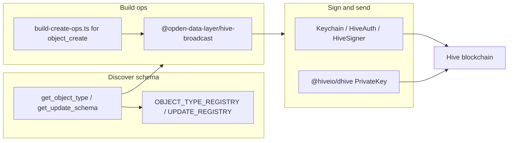

# Hive blockchain broadcast (ODL)

Build, sign, and broadcast Hive transactions for **ODL** (`custom_json` envelopes) and standard Hive ops using this repo's libraries and registries.

**Prerequisite:** an existing Hive account — see [Hive account signup](hive-account-signup.md).

## When to use

- Create or update ODL objects on chain (`object_create`, `update_create`, votes, authority, follow, …).
- Broadcast standard Hive ops (vote, comment, follow, reblog) that the web app uses.
- Agent needs to know **which update types** an object type supports and **how to shape payloads**.

## When not to use

- Account signup — [hive-account-signup.md](hive-account-signup.md).
- Read-only queries — use **query-api** / Postgres (indexed state), not broadcast.
- **OBL business lifecycle** (offers, contracts, invoices, payments, disputes) — use [obl-offers-contracts](obl-offers-contracts.md), [obl-ledger](obl-ledger.md), [obl-disputes](obl-disputes.md); those skills call `buildObl*` then return here for custody/sign.
- Server-side auth login — [auth-api challenge flow](../apps/auth-api/spec/challenge-flow.md) (signature verify only, not chain write).

### OBL envelopes (short)

OBL `custom_json` ids are **`obl-mainnet` / `obl-testnet`** (not `odl-*`). Build with `@opden-data-layer/hive-broadcast` helpers: `buildOblOfferPublishOp`, `buildOblContractSignOp`, `buildOblInvoiceIssueOp`, `buildOblPaymentDeclareOp`, `buildOblPaymentConfirmOp`, `buildOblDisputeOpenOp`, `buildOblDisputeResolveOp`, etc. Full cycle playbooks: skills above.

## Key custody (decide with the user first)

After signup, **ask explicitly** how signing should work before building or sending transactions:

| Mode | Who holds keys | Agent role | Typical use |
|------|----------------|------------|-------------|
| **Wallet (recommended)** | User (Keychain, HiveAuth, HiveSigner) | Build `HiveOperation[]`; user approves in wallet UI | Browser / interactive |
| **Payload only** | User | Agent outputs JSON ops + envelope; user signs elsewhere | Maximum safety |
| **Session posting key** | User pastes **posting** key for one session/script | Agent signs with `@hiveio/dhive` locally | Automation, CI, bots — **high risk** |

Rules:

- **Never** persist posting/active/owner/memo keys in repo, `.env` commits, chat logs, or agent memory unless the user **explicitly** chooses session-key mode for a bounded task — and clear after use.
- **Default:** wallet or payload-only; do not ask for keys proactively.
- ODL writes almost always need **posting** authority (`required_posting_auths: [account]`).
- Link back to [signup key rules](hive-account-signup.md#key-handling-rules-mandatory): no password reset, confirm username.
- **Also pick ODL network** (`mainnet` / `testnet`) once per conversation — [§ ODL network](#odl-network-mainnet-vs-testnet).

## Architecture map



| Layer | Package / tool | Role |
|-------|----------------|------|
| Operation builders | [`@opden-data-layer/hive-broadcast`](../../../libs/hive-broadcast/src/index.ts) | Normalized `HiveOperation` + ODL `custom_json` builders |
| Registries (source of truth) | `@opden-data-layer/core` — `OBJECT_TYPE_REGISTRY`, `UPDATE_REGISTRY` | Valid object/update types |
| Registry for agents | **knowledge-api MCP** — `list_object_types`, `get_object_type`, `list_update_types`, `get_update_schema` | Schemas, examples, supported/supposed updates |
| Object create (multi-event) | [`apps/web/.../build-create-ops.ts`](../../../apps/web/src/modules/object-create/application/build-create-ops.ts) | `object_create` + many `update_create`; chunking / IPFS |
| Web signing | `getWalletFacade().broadcast()` | Browser wallets |
| Standalone signing | `@hiveio/dhive` | `Client` + `PrivateKey` (posting) |

## ODL network (mainnet vs testnet)

ODL does **not** use a separate Hive blockchain. Mainnet and testnet are **namespaces** on the same chain: the Hive `custom_json.id` field separates production ODL state from dev/sandbox state.

| `ODL_NETWORK` (env) | Hive `custom_json.id` | Typical use |
|---------------------|------------------------|-------------|
| `mainnet` (default) | `odl-mainnet` | Production Waivio/ODL apps, public data |
| `testnet` | `odl-testnet` | Local dev, staging experiments, agent smoke tests |

**Must stay consistent across a deployment:**

| Component | Config |
|-----------|--------|
| **web** broadcasts | `ODL_NETWORK` → [`useOdlCustomJsonId()`](../../../apps/web/src/config/odl-network-provider.tsx) |
| **chain-indexer** ingestion | same `ODL_NETWORK` — only txs with matching `custom_json.id` are indexed |
| **query-api** reads | Postgres reflects whichever network the indexer ingested |

A tx on `odl-testnet` is valid on Hive but **invisible** to a mainnet-indexed site (and vice versa). Never mix ids in one workflow or transaction batch.

Resolver (same mapping as web): [`resolveOdlCustomJsonId`](../../../apps/web/src/config/odl-network.ts).

### Agent rule — ask once, remember for the session

Before the **first** ODL broadcast in a conversation (right after key custody, or together with it):

1. **Ask explicitly:** *“Which ODL network — **mainnet** (production) or **testnet** (dev/sandbox)?”*
2. **Infer only when obvious** — e.g. user says “local docker”, “staging `.env` has `ODL_NETWORK=testnet`”, or “write to production Waivio” → state the inference and confirm in one line.
3. **Record in session** (conversation context, not repo files):
   - `odlNetwork`: `mainnet` | `testnet`
   - `odlCustomJsonId`: `odl-mainnet` | `odl-testnet`
4. **Reuse on every later broadcast** in the same chat — pass `id: odlCustomJsonId` to all `buildOdl*` ops and `object_create` envelopes. Do **not** re-ask unless the user switches networks.
5. **Switch only on user request** — if they change network mid-session, update both variables and say so before the next tx.

Defaults when the user does not care:

| Context | Default |
|---------|---------|
| Production / public app / “real” objects | `mainnet` → `odl-mainnet` |
| Local repo, CI smoke, throwaway test objects | `testnet` → `odl-testnet` |

Scripts with session posting key: read `process.env.ODL_NETWORK` (or ask user) — same value as root `.env` / compose for that stack.

Envelope shape (normative): [`docs/spec/README.md`](../spec/README.md) § ODL event ids.

```json
{ "events": [ { "action": "…", "v": 1, "payload": { } } ] }
```

Actions: `object_create`, `update_create`, `update_vote`, `rank_vote`, `object_authority`, `object_follow`, `user_follow`, `batch_import`, … — indexer handlers in [odl-pipeline](../apps/chain-indexer/spec/odl-pipeline.md).

## Step 1 — Resolve object/update schema (MCP)

With **knowledge-api** running (`pnpm nx serve knowledge-api`):

1. `list_object_types` — pick `object_type`.
2. `get_object_type({ object_type: "product" })` — returns:
   - `supported_updates`, `supposed_updates`
   - `example_create_payload` — minimal `object_create` wire example
   - `markdown` — human-readable spec
3. For each update field: `get_update_schema({ update_type: "title" })` — `value_kind`, `cardinality`, `json_schema`, `example_payload`.

Registry code (if you have a checkout): `libs/core/src/object-type-registry/`, `libs/core/src/update-registry/`.

Do **not** invent `object_type` or `update_type` strings — they must exist in the registry or the indexer rejects the tx.

## Step 2 — Build operations (`@opden-data-layer/hive-broadcast`)

Install deps (standalone script outside monorepo is harder — **prefer cloning this repo** per [setup-workspace.md](setup-workspace.md)):

```bash
pnpm install   # root; includes @hiveio/dhive and workspace libs
```

Import builders from `@opden-data-layer/hive-broadcast`:

### ODL builders (library)

| Builder | ODL action(s) | Notes |
|---------|---------------|--------|
| `buildOdlUpdateCreateOp` | `update_create` | `valueKind`: text/geo/json/object_ref/user_ref; indexer auto-likes from `creator` |
| `buildOdlUpdateCreateWithRankVoteOp` | `update_create` (aggregateRating) + `rank_vote` | Same tx |
| `buildOdlUpdateVoteOp` | `update_vote` | `for` / `against` / `remove` |
| `buildOdlRankVoteOp` | `rank_vote` | rank 0–10000 |
| `buildOdlObjectAuthorityOp` | `object_authority` | administrative / ownership |
| `buildOdlObjectFollowOp` | `object_follow` | follow / unfollow / bell |
| `buildOdlUserFollowBellOp` | `user_follow` | bell toggle |
| `buildOdlBatchImportOp` | `batch_import` | IPFS CID; large creates |

### Standard Hive builders

| Builder | Op |
|---------|-----|
| `buildVoteOp` | `vote` |
| `buildCommentOp` | `comment` |
| `buildCommentOptionsOp` | `comment_options` |
| `buildReblogOp` | `custom_json` id `follow` |
| `buildHiveFollowOp` / `buildHiveUnfollowOp` | Hive social follow |
| `buildCustomJsonOp` | Low-level; prefer ODL helpers |

### `object_create` (not a separate builder in hive-broadcast)

New objects need **`object_create`** plus one or more **`update_create`** events:

1. Use `get_object_type` → `example_create_payload` as template.
2. For full publish logic (field order, chunking, IPFS): read [object-create-broadcast](../apps/web/spec/object-create-broadcast.md) and [`buildAllCreateEvents`](../../../apps/web/src/modules/object-create/application/build-create-ops.ts).

Limits:

- `HIVE_CUSTOM_OP_DATA_MAX_LENGTH` = **8192** UTF-8 bytes per `custom_json.json`
- Max **5** `custom_json` ops per transaction for object create (web constant `OBJECT_CREATE_MAX_OPS_PER_TRX`)
- Oversized payloads → IPFS + `buildOdlBatchImportOp`

Example — single field update after object exists:

```ts
import { buildOdlUpdateCreateOp } from '@opden-data-layer/hive-broadcast';

const odlCustomJsonId = 'odl-mainnet'; // session choice — see § ODL network

const op = buildOdlUpdateCreateOp({
  id: odlCustomJsonId,
  objectId: 'product-abc123',
  updateType: 'title',
  creator: 'alice',
  valueKind: 'text',
  value: 'My product',
  required_posting_auths: ['alice'],
});
// op.type === 'custom_json'
```

## Step 3 — Sign and broadcast

### A) Browser wallet (web app pattern)

Normalized ops → wallet wire format → user confirms:

- [`keychain-signer.ts`](../../../apps/web/src/modules/auth/infrastructure/signers/keychain-signer.ts) maps `HiveOperation` → Keychain tuples.
- `getWalletFacade().broadcast({ operations: [op] })` → `{ transactionId }`.

Agents in browser automation: build ops in JS, invoke wallet; **do not** extract keys from extension storage.

### B) `@hiveio/dhive` (script / agent with session posting key)

Only when user **explicitly** opts in to session-key mode:

```ts
import { Client, PrivateKey } from '@hiveio/dhive';
import { buildOdlUpdateCreateOp } from '@opden-data-layer/hive-broadcast';

const account = 'alice';
const odlCustomJsonId =
  process.env.ODL_NETWORK === 'testnet' ? 'odl-testnet' : 'odl-mainnet';
const postingKey = PrivateKey.fromString(process.env.HIVE_POSTING_KEY!); // session only — never commit
const client = new Client(['https://api.hive.blog']);

const op = buildOdlUpdateCreateOp({
  id: odlCustomJsonId,
  objectId: 'product-abc123',
  updateType: 'title',
  creator: account,
  valueKind: 'text',
  value: 'Hello',
  required_posting_auths: [account],
});

const result = await client.broadcast.sendOperations(
  [
    [
      'custom_json',
      {
        required_auths: op.required_auths,
        required_posting_auths: op.required_posting_auths,
        id: op.id,
        json: op.json,
      },
    ],
  ],
  postingKey,
);

console.log(result.id); // transaction_id
```

Map other `HiveOperation` types the same way as [`keychain-signer.ts`](../../../apps/web/src/modules/auth/infrastructure/signers/keychain-signer.ts) (`vote`, `comment`, …).

## Step 4 — Confirm on chain

- Poll `condenser_api.get_transaction` / block explorer with `transaction_id`.
- Web app: `awaitTrxConfirmation(trxId)` via notifications WS — see [`apps/web/AGENTS.md`](../../../apps/web/AGENTS.md).
- Indexer lag: query-api may update after **chain-indexer** processes the block — allow seconds.

## Agent workflow checklist

1. Confirm account exists; agree **key custody mode** and **ODL network** (`mainnet` / `testnet`) with user — **remember both for all broadcasts in this conversation**.
2. `get_object_type` / `get_update_schema` for the task.
3. Build `HiveOperation[]` with `@opden-data-layer/hive-broadcast` (+ `build-create-ops` pattern if creating objects).
4. Validate JSON size ≤ 8192 bytes per op (or plan IPFS batch).
5. Sign (wallet or dhive per mode).
6. Return `transaction_id`; verify account/op on chain.
7. If session key was used — remind user to revoke/clear it.

## Verification

```bash
pnpm nx test hive-broadcast
pnpm nx test web --testPathPattern=build-create-ops   # object create chunking
```

MCP smoke:

- `get_object_type` with a known type (e.g. `product`, `list`)
- `get_update_schema` with `title`

## Related

- [Hive account signup](hive-account-signup.md) — account + key custody choice
- [Setup workspace](setup-workspace.md) — clone repo for libs
- [OBL offers and contracts](obl-offers-contracts.md) · [OBL ledger](obl-ledger.md) · [OBL disputes](obl-disputes.md)
- [Object create broadcast](../apps/web/spec/object-create-broadcast.md) — chunking / IPFS
- [ODL pipeline](../apps/chain-indexer/spec/odl-pipeline.md) — what indexer accepts
- [Objects domain](../spec/objects-domain.md) — ResolvedView after indexing
- [knowledge-api overview](../apps/knowledge-api/spec/overview.md) — MCP tools
