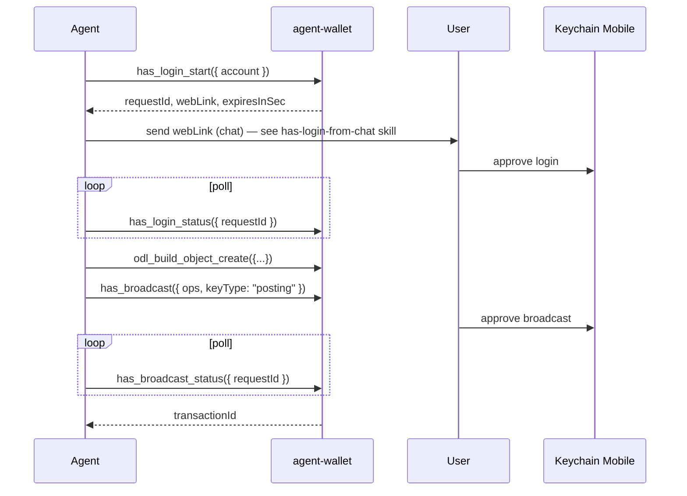

# HAS agent wallet (local MCP daemon)

Local NestJS daemon (`apps/agent-wallet`) that holds a **HAS session** (not private keys) and exposes MCP tools for login, ODL envelope build, and broadcast with **Keychain Mobile** approval.

**Prerequisite:** Hive account + Keychain (or compatible PKSA) on phone — see [Hive account signup](hive-account-signup.md).

## When to use

- Autonomous agent (Cursor, shell) must broadcast ODL txs **without** session posting keys.
- User approves each login and each broadcast on phone (or auto-approve rules in Keychain).
- Agent builds `object_create` envelopes via MCP instead of copying web form logic.

## When not to use

- Interactive browser session — use web wallets (Keychain extension, HiveAuth in browser).
- User explicitly wants **session posting key** automation — see [hive-blockchain-broadcast § B](hive-blockchain-broadcast.md#b-hiveiodhive-script--agent-with-session-posting-key).
- Hosted/multi-user signing service — out of scope; this daemon is **localhost only**.

## Security model

| Property | Value |
|----------|--------|
| Bind | `127.0.0.1:7500` only |
| CORS | **disabled** — browser pages cannot call the daemon |
| MCP auth | `Authorization: Bearer <token>` on every request |
| Token file | `~/.odl/agent-wallet.token` mode `0600` (generated on first start) |
| Session file | `~/.odl/agent-wallet-session.json` mode `0600` — contains `auth_key` + `token` (**secret**) |
| Keys on phone | User private keys never leave Keychain; agent holds HAS session material only |

## Quick start

**Requirements:** Node.js 20+ (uses global `crypto.randomUUID()`).

### Option A — single-file release (recommended)

```bash
curl -Lo agent-wallet.js \
  https://github.com/Waiviogit/open-data-layer/releases/latest/download/agent-wallet.js
curl -Lo agent-wallet.js.sha256 \
  https://github.com/Waiviogit/open-data-layer/releases/latest/download/agent-wallet.js.sha256
sha256sum -c agent-wallet.js.sha256   # POSIX — verify before running
node agent-wallet.js
```

PowerShell:

```powershell
Invoke-WebRequest -Uri https://github.com/Waiviogit/open-data-layer/releases/latest/download/agent-wallet.js -OutFile agent-wallet.js
node agent-wallet.js
```

No `mcp.json` required. The agent reads the bearer token from `~/.odl/agent-wallet.token` and sends JSON-RPC directly to `http://127.0.0.1:7500/agent-wallet/mcp` via `fetch` or `curl`.

### Option B — from monorepo checkout

For agents that already cloned the repo per [setup-workspace.md](setup-workspace.md):

```bash
pnpm install
pnpm nx serve agent-wallet
```

On first start the daemon prints and writes the bearer token. Read it:

```bash
# POSIX
cat ~/.odl/agent-wallet.token

# Windows (PowerShell)
Get-Content $env:USERPROFILE\.odl\agent-wallet.token
```

MCP endpoint: `POST http://127.0.0.1:7500/agent-wallet/mcp`

Optional env (see [agent-wallet overview](../apps/agent-wallet/spec/overview.md)):

| Variable | Default |
|----------|---------|
| `PORT` | `7500` |
| `HOST` | `127.0.0.1` |
| `ODL_NETWORK` | `testnet` → `odl-testnet` |
| `HAS_WS_URL` | `wss://hive-auth.arcange.eu` |
| `HAS_WEB_LINK_BASE` | `https://waiviodev.com` — origin for clickable `webLink` in chat; set empty to disable |
| `AGENT_WALLET_NO_PERSIST` | `false` — set `true` for memory-only session |

## Agent workflow



### 1. MCP initialize

Send JSON-RPC to `/agent-wallet/mcp` with bearer header. Tool names:

| Tool | Purpose |
|------|---------|
| `has_login_start` | Start HAS auth; returns `requestId`, `alreadyActive`, `expiresAt`, `expiresInSec`, `pushSent`, `webLink`; `deepLink` only when no web link is configured |
| `has_login_status` | Poll: `pending` / `active` / `rejected` / `expired` |
| `has_login_qr` | Fallback artefacts for a pending login: `deepLink`, `qrAscii`, optional `qrPngPath` |
| `has_session` | `{ active, session: { account, expiresAt } }` — no secrets |
| `has_logout` | Clear session + session file |
| `odl_build_object_create` | Build `custom_json` ops from registry-validated fields |
| `has_broadcast` | Start sign flow; returns `requestId` |
| `has_broadcast_status` | Poll: `pending` / `signed` / `rejected` / `error` / `expired` |

### 2. Login

**Chat / Telegram / Slack:** follow [has-login-from-chat](has-login-from-chat.md) — send `webLink` verbatim and nothing else. `deepLink` and `qrAscii` are base64 of JSON, so they start with `eyJ` and chat clients redact them as leaked JWTs.

```json
// tools/call has_login_start
{ "account": "alice" }
```

Terminal / second device: call `has_login_qr` with the `requestId` and show `qrAscii`, or open `deepLink`. Poll `has_login_status` until `active`.

Repeating `has_login_start` for the same account returns the existing pending request while it is still alive, so retries do not invalidate a link already sent.

### 3. Build object create

```json
// tools/call odl_build_object_create
{
  "objectType": "recipe",
  "objectId": "recipe-demo-1",
  "creator": "alice",
  "fields": [
    { "updateType": "name", "value": "Borscht" },
    { "updateType": "description", "value": "Beet soup" }
  ]
}
```

Uses `UPDATE_REGISTRY` Zod schemas (not web form validators). Returns `ops`, `opsCount`, `bytes`, `warnings`.

Resolve field shapes first via knowledge-api: `get_object_type`, `get_update_schema`.

### 4. Broadcast

```json
// tools/call has_broadcast
{ "ops": [/* from odl_build_object_create */], "keyType": "posting" }
```

Poll `has_broadcast_status` until `signed` with `transactionId` or terminal failure (`rejected`, `error`, `expired`).

### 5. Confirm indexing

Same as [hive-blockchain-broadcast § Step 4](hive-blockchain-broadcast.md#step-4--confirm-on-chain). Match `ODL_NETWORK` with chain-indexer / query-api.

## Reject / failure handling

- Login `rejected` → user declined in Keychain; call `has_login_start` again.
- Broadcast `rejected` → user declined sign; do not retry silently — confirm with user.
- `expired` → HAS timeout; restart the flow.
- Never log or paste bearer token, session file contents, or `auth_key` from deep links.

## Libraries

| Package | Role |
|---------|------|
| `@opden-data-layer/hive-auth` | Node HAS client (`HasClient`), deep links, crypto compatible with PKSA |
| `@opden-data-layer/hive-broadcast` | `buildObjectCreateEnvelope`, chunking |
| `apps/agent-wallet` | MCP daemon |

Web HAS (`hive-auth-wrapper`) is **not** migrated — separate track.

## Verification

```bash
pnpm nx test hive-auth
pnpm nx test hive-broadcast
pnpm nx test agent-wallet
pnpm nx e2e agent-wallet-e2e
```

Manual on `odl-testnet` with real phone: login → `object_create` → approve → check query-api; repeat with **Reject** on broadcast.
