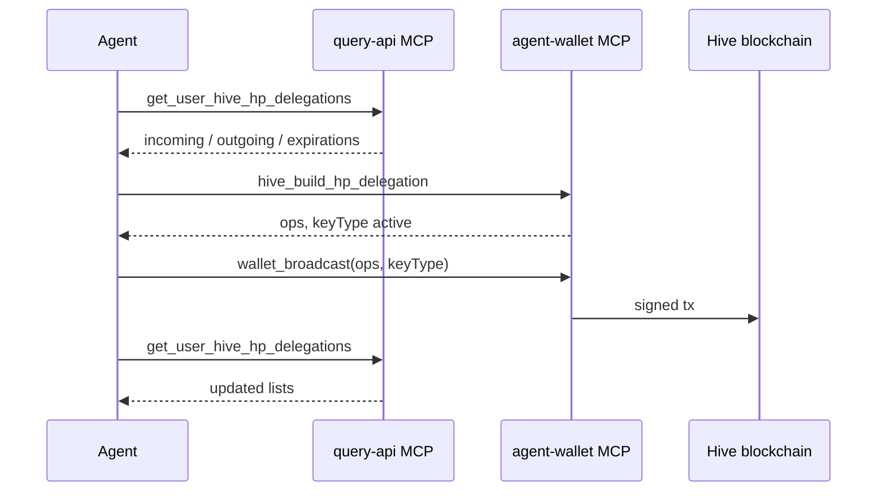

# Wallet delegations, balances, and swaps for agents

Read **Hive L1**, **WAIV**, and **Engine** wallet state via **query-api MCP**; build delegation ops via **agent-wallet**; broadcast with the correct **keyType**; verify via query-api (indexer lag applies).

## When to use

- Agent must **list** who delegated HP/RC/WAIV to an account or who the account delegated to.
- Agent must **send or update** HP, RC, or WAIV (Engine token) delegations.
- Agent needs **wallet balances** or **swap quotes** before a user-approved broadcast.

## When not to use

- ODL object writes — [hive-blockchain-broadcast.md](hive-blockchain-broadcast.md).
- OSL messaging — [osl-messaging.md](osl-messaging.md).
- Incoming delegator lists from **Hive RPC alone** — not available without query-api/indexer (see Fallback limits).

## MCP servers

| Server | Role |
|--------|------|
| **query-api** `POST /query/mcp` | Balances, delegation lists, swap/deposit/withdraw quotes |
| **agent-wallet** `POST /agent-wallet/mcp` | Build delegation ops, broadcast |
| **knowledge-api** | Specs under `docs/apps/query-api/spec/user-*-wallet*` |

## Authority matrix

| Operation | agent-wallet build tool | Chain auth | `wallet_broadcast` keyType |
|-----------|-------------------------|------------|----------------------------|
| HP delegate / undelegate | `hive_build_hp_delegation` | active | `active` |
| RC delegate / remove | `hive_build_rc_delegation` | posting | `posting` |
| Engine (WAIV) delegate / undelegate | `engine_build_token_delegation` | active | `active` |
| Engine swap / withdraw quote ops | quote `customJson[]` from query-api | active | `active` |

Local mode: `active` requires the grantor account to have `active` in `accounts.json` (`wallet_accounts` / `wallet_status.activeReady`). HAS mode: user confirms active key on phone.

## Read (query-api MCP)

| Tool | Purpose |
|------|---------|
| `get_user_hive_wallet` | Hive L1 summary (liquid, HP, RC, savings, net delegations) |
| `get_user_hive_hp_delegations` | HP `incoming[]`, `outgoing[]`, `expirations[]` |
| `get_user_hive_rc_delegations` | RC incoming (indexed) + outgoing (`rc_api`) |
| `get_user_waiv_wallet` | WAIV balances and delegation aggregates |
| `get_user_engine_wallet` | Engine token balances |
| `get_user_engine_token_delegations` | Per-symbol Engine delegations (`symbol: WAIV`, …) |
| `get_user_engine_swap_list` | Swappable tokens and pools |
| `post_user_engine_swap_quote` | AMM quote → `customJson[]` |
| `post_user_engine_withdraw_quote` | Withdraw quote → `customJson[]` |

**Incoming vs outgoing:** `incoming[]` = received delegations **to** the profile account; `outgoing[]` = delegated **from** the account. HP undelegations in progress appear in `expirations[]` (~5 days).

HTTP parity: [user-hive-wallet-endpoint.md](../apps/query-api/spec/user-hive-wallet-endpoint.md), [user-waiv-wallet-endpoint.md](../apps/query-api/spec/user-waiv-wallet-endpoint.md), [user-engine-swap-endpoints.md](../apps/query-api/spec/user-engine-swap-endpoints.md).

## Write (agent-wallet MCP)

1. `wallet_status` — signing mode, `activeReady`, account
2. Build op(s) — one of:
   - `hive_build_hp_delegation({ delegator, delegatee, amountHp? | vestingShares? })` → `keyType: active`
   - `hive_build_rc_delegation({ from, delegatees[], maxRc })` → `keyType: posting`; **`maxRc: 0` removes** delegation
   - `engine_build_token_delegation({ account, symbol, quantity, action, to? | from? })` → `keyType: active`
3. `wallet_broadcast({ ops, keyType })` or `has_broadcast` — **must pass `keyType` from build result**
4. Poll `wallet_broadcast_status` / `has_broadcast_status`

### HP notes

- Undelegate: `amountHp: 0` → `0.000000 VESTS` to the same delegatee; HP returns over ~5 days (`expirations[]`).
- Minimum delegation ~1 HP worth of VESTS (warnings below that).

### RC notes

- Payload shape (peakd-compatible): `["delegate_rc", { from, delegatees: string[], max_rc }]`.
- `max_rc` is **absolute RC units** (UI may show billions, e.g. `111000000000` = 111b RC).
- Reducing RC burns unused delegated RC; delegator must keep ~3e9 RC reserve.

### Swaps (no dedicated build tool)

1. `post_user_engine_swap_quote` or `post_user_engine_withdraw_quote` (query-api MCP)
2. `wallet_broadcast({ ops: quote.customJson, keyType: "active" })`

## Verify after broadcast

1. Re-call the matching read tool (`get_user_hive_hp_delegations`, `get_user_hive_rc_delegations`, `get_user_engine_token_delegations`).
2. Allow **indexer lag** (seconds to minutes) for incoming/outgoing lists.
3. HP undelegate: check `expirations[]` immediately; full removal from `outgoing[]` after completion window.

## Helpers (`@opden-data-layer/hive-broadcast`)

| Builder | Use |
|---------|-----|
| `buildDelegateVestingSharesOp` | HP (active) |
| `buildDelegateRcOp` | RC (posting); `{ from, delegatees, maxRc }` |
| `buildHiveEngineTokensOp` | WAIV/Engine delegate/undelegate (active) |

HP conversion: `hpToVestingShares` from `@opden-data-layer/core/hive-account-history`.

## Hive RPC fallback limits

| Need | query-api | Hive RPC alone |
|------|-----------|----------------|
| Who delegated HP **to me** (list) | `incoming[]` (indexed) | Net on account only — **no delegator list** |
| Who I delegated HP to | `outgoing[]` | — |
| Pending HP undelegations | `expirations[]` | `find_vesting_delegation_expirations` |
| RC delegations | incoming + outgoing endpoints | outgoing via `rc_api`; incoming needs indexer |
| WAIV delegations | per-symbol endpoint | Engine RPC outgoing only |

**Agents:** use query-api MCP for incoming delegation lists; do not expect Hive condenser to return delegators.

## Flow

## Verification

- `pnpm nx test agent-wallet --testPathPatterns=wallet-delegation`
- `pnpm nx test hive-broadcast --testPathPatterns=hive-l1-wallet`
- query-api MCP `tools/list` includes `get_user_hive_wallet` and delegation tools
