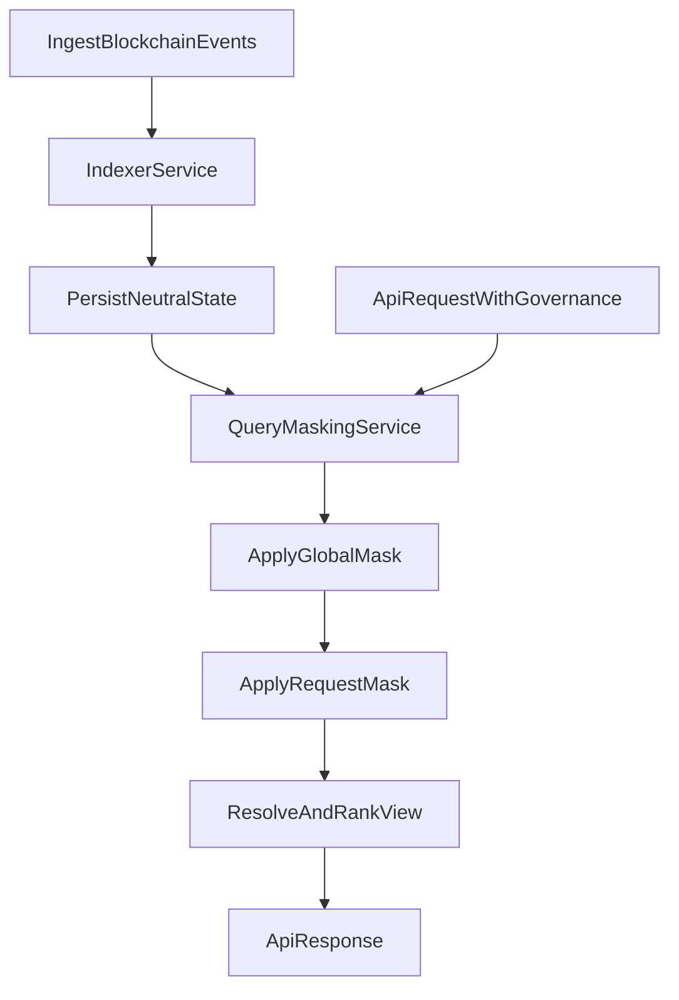

# Project Specification: Open Data V2

## 1. Goal

Define a deterministic architecture for:

- indexing blockchain object/update events,
- resolving competing updates with vote semantics,
- applying governance as request-time masks,
- supporting overflow publishing (Hive baseline + Arweave emergency path).

## 2. Service boundary (normative)

### 2.1 Indexer Service

- Reads blockchain events in canonical order:
  `(block_num, trx_index, op_index, transaction_id)`.
- Validates schema/business invariants for write events.
- Stores neutral materialized state without tenant governance masking.

### 2.2 Query/Masking Service

- Accepts read request and governance context.
- Resolves governance graph and role scopes.
- Applies global + request governance masks to neutral state.
- Returns filtered and ranked views.

## 3. Namespaces and core entities

Namespaces:

- `od.objects.v1` (`object_create`)
- `od.updates.v1` (`update_create`, `update_vote`)
- Governance is represented as normal objects with `object_type = governance`.
- There is no separate governance namespace in V2.

Core entities:

- `object`: `object_id`, `object_type`, `creator`, `transaction_id`
- `update`: `update_id`, `object_id`, `update_type`, payload fields, `creator`, `transaction_id`
- `vote`: `(update_id, voter) -> effective_vote`
- `governance declaration`: object with `object_type = governance` that defines roles, trust, and moderation rules
- `object_type` (new entity): type descriptor with:
  - `name` (for example `product`, `recipe`)
  - `supported_updates` (allowed update kinds validated by indexer)
  - `supposed_updates` (automation-intended update kinds; execution mechanism is out of scope for now)

## 4. Indexer write semantics

### 4.1 Object creation

- `object_id` is globally unique.
- First valid `object_create` wins by canonical order.
- Later `object_create` with same `object_id` are rejected with `OBJECT_ALREADY_EXISTS`.
- Governance objects are created through `object_create` with `object_type = governance`.
- Governance object lifecycle is Hive-only (no off-chain direct mutation).

### 4.2 Update and vote semantics

- `update_create` must match the object type policy:
  - target object's `object_type` must exist in `object_type` registry,
  - `update_type` must be listed in that type's `supported_updates`,
  - otherwise reject with `UNSUPPORTED_UPDATE_TYPE`.
- `update_create` starts as `weight = 0`, `status = VALID`.
- One active vote per `(update_id, voter)`.
- Revote is replace:
  - `delta = new_effective_vote - old_effective_vote`
  - `weight += delta`
- Dynamic status:
  - `VALID` if `weight >= 0`
  - `REJECTED` if `weight < 0`

### 4.3 Governance object ownership rules

- After a governance object is created, only its `creator` may:
  - publish updates targeting that governance object,
  - vote for or against updates targeting that governance object.
- Any governance update/create/vote action by another account is rejected with `UNAUTHORIZED_GOVERNANCE_OP`.

### 4.4 LWW rule for single fields

- For single-value fields (winner is exactly one value), if the same account publishes a newer update for the same field:
  - the previous update from that same account for that field is removed from current state,
  - the newer update becomes the active contribution from that account for that field.
- This is deterministic last-write-wins behavior scoped to `(object_id, field_key, creator)`.

### 4.5 Object type governance rules

- `object_type` entities are created and updated only through Hive events.
- `object_type` creation is restricted to main governance:
  - only main governance creator may create new `object_type` entities.
- `object_type` update is restricted to main governance:
  - only main governance creator may update existing `object_type` entities.
- Main governance reference is provided by deployment configuration and must be deterministic across indexer instances in one environment.

### 4.6 supported vs supposed updates

- `supported_updates` is normative for indexer validation.
- `supposed_updates` is descriptive metadata for automation opportunities.
- Indexer does not execute automation from `supposed_updates`; it only stores and exposes this metadata.

## 5. Query-time governance masking

### 5.1 Mask inputs

Each response is filtered by two governance layers:

1. Platform/global policy mask (mandatory baseline).
2. Request governance mask (provided directly or resolved from subscription profile).

### 5.2 Precedence

- Global mask always has higher priority.
- Request mask may narrow but never override global restrictions.

### 5.3 Domains

- Data domain roles: `owner`, `admin`, `trusted`.
- Social domain role: `moderator`.
- Domain-specific effects are defined in `spec/governance_resolution.md`.

## 6. Governance resolution and caching

- Governance objects are indexed as neutral declarations.
- Query service computes an effective governance set for each governance input.
- Effective governance sets are cached.
- Cache invalidation is required when:
  - referenced governance objects change,
  - trust graph edges change,
  - role assignments relevant to the computed set change.

## 7. Overflow publishing strategy

- Default path: publish via Hive.
- Emergency path: publish via Arweave for:
  - large initial import,
  - queue backlog drain.
- Operational behavior (thresholds, confirmation polling, TTL, retries) is defined in `spec/overflow_strategy.md`.

## 8. Logical storage model

- `events_log` (canonical raw events + apply/reject result)
- `objects_current`
- `updates_current`
- `update_votes_current`
- `governance_objects_current`
- `governance_resolution_cache` (query layer)
- `query_policy_profiles` (optional mapping for subscription governance defaults)

## 9. Processing flow

## 10. Acceptance criteria (high level)

- Reindexing same stream produces identical neutral state and reject log.
- Same neutral state with different governance inputs can produce different masked output.
- Same neutral state with same governance inputs always produces identical output.
- Global policy restrictions cannot be bypassed by request governance.
- Overflow policy switches to Arweave when configured thresholds are exceeded.
- Governance object updates/votes are accepted only from governance object creator.
- For single fields, repeated updates by same creator resolve via deterministic LWW.
- Only main governance can create/update `object_type` entities.
- `update_create` is accepted only when `update_type` is listed in `supported_updates` for target object type.

